# Tips and Tricks for Building chatbots with a better understanding of user input

One of the key things that we can teach our chatbots is to analyse the user's input and redirect the user to the correct conversation. This is done by training our chatbots with a set of Triggering Expressions.

> Triggering Expressions — are sample expressions/sentences that we train our chatbots with to recognise specific Conversations.
>
> The idea is that if we have a Q&A type conversation:
>
> -  **name:** best-pizza
> - **triggering expression:**
>   - "What is the best pizza?"
>   - "Number one pizza"
> - **answer:** *"Hawaiian Pizza is the best. 🍍+🐷=😍🍕"*
>
> So that when a user says something like: *"What is the number one pizza?"*
> The chatbot should match it to the **best-pizza** and respond with:
> *"Hawaiian Pizza is the best. 🍍+🐷=😍🍕"*

However, this is not always as straightforward, as it seems, and sometimes triggering expressions in one conversation can affect responses from a different conversation.

In this article, we will look at five [NativeChat](https://www.progress.com/nativechat) tips and tricks on how to build chatbots with a great understanding of user input.

> If you are not familiar with NLP and how it works, then you should start with this article: [What is Natural Language Processing?](https://www.progress.com/blogs/what-is-natural-language-processing-(nlp))

### Tip #1 — Test with Understanding

As we train our chatbot and provide it with new triggering expressions (which should trigger a specific response), it is good to test the new expressions as we go, and see what your chatbot would respond with.

NativeChat has a feature called **Understanding**, which allows you to test chatbot's understanding of various expressions.
You can find it in the test window by switching to the **Understanding** tab.

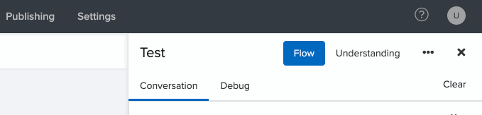

To use it, just type any expressions, press Enter, and NativeChat will respond with:

- the best-matched conversation
- the confidence score

> Note, confidence above 65% means that the chatbot would accept that conversation as a valid match.

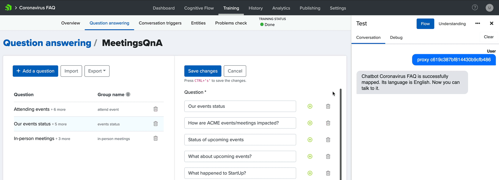

You can also use Understanding to see what Entities the chatbot recognises.


> It is good practice to regularly check the changes that we make to our chatbot's training, and make sure that we get the results that we expect.

### Tip #2 — Run Problems Check

Sometimes, when we add a new conversation with a set of triggering expressions to our existing chatbots, it is possible that the new triggering expressions could interfere with other conversations. As a result of which, it is possible that adding a new conversation to our chatbot could make our chatbot not recognise conversations that used to work just fine.

It would be quite hard to manually test every conversation we have in the chatbot. However, NativeChat has a feature called **Problems Check** that allows you to test all the triggering expressions, and validate them against the conversations that were used to create the NLP Training Model.

You can find the **Problems Check** page by either:

- going to the **Dashboard** page and then navigating to the **Problems check** page
- going to the **Training** tab and then choosing the **Problems check** sub-tab

Then start the test by pressing the **Run a quality check** button.

For each triggering expression, you will see the expected conversation, the matched conversation, and the confidence level of that match. Like this:

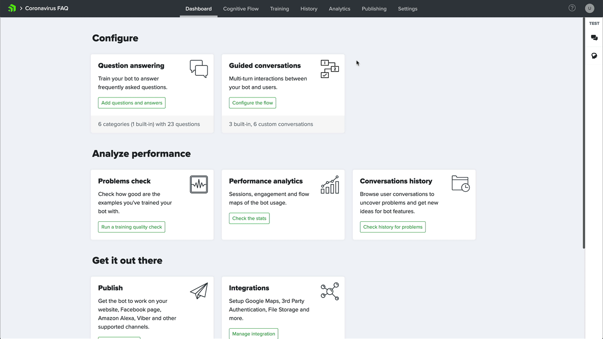

Problems check is a very useful tool to quickly check if any conversation doesn't get triggered as expected. This way you can identify potential issues, and make sure your user experience stays top-notch.

### The Very Similar Triggering Expressions problem

Sometimes, you might have multiple very similar triggering expressions, which are so close to each other that they fail to match even for exact matches.

For example, you might have four conversations with triggering questions like:
"What is the location of officeX?"

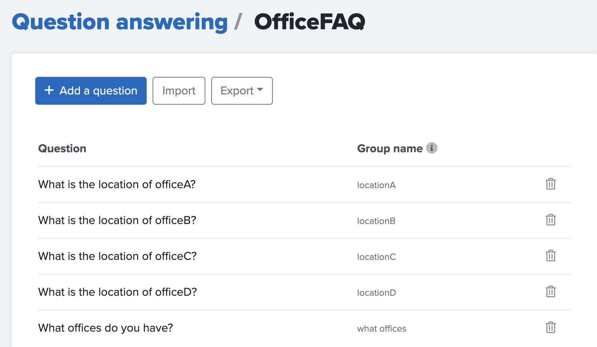

When we run **Problems check** against that set of triggering expressions, NLP will fail to match any of these four conversations.

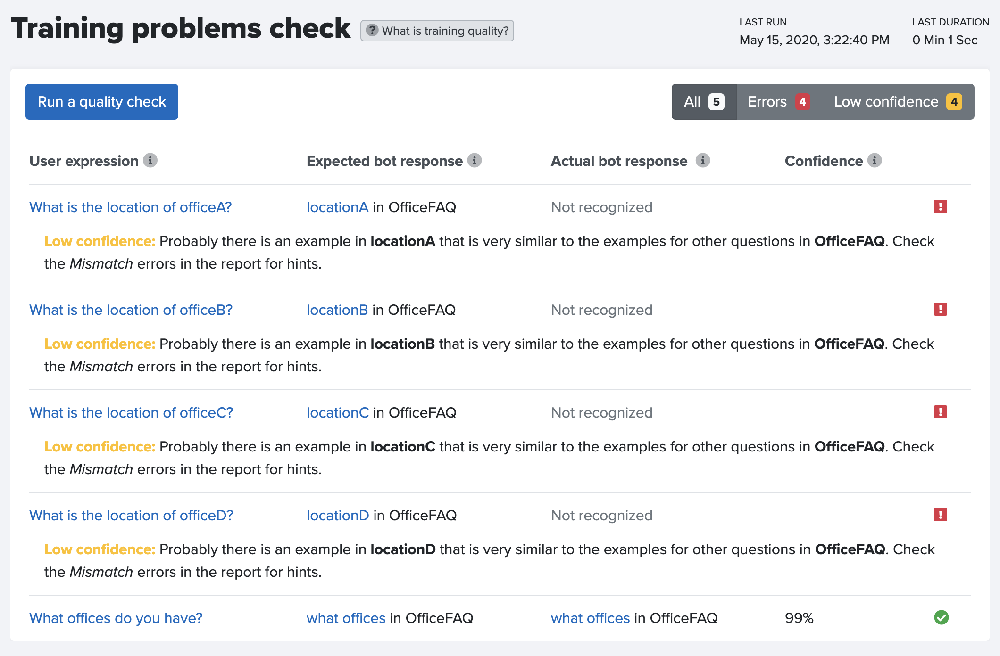


This is because, in each case, NLP will match **(What)**, **(is)**, **(the)**, **(location)**, **(of)**, and **(?)** tokens (words/punctuation marks). While the match to **(officeX)**, will either be exact or too close for the NLP to decide which of the triggering conversations is strong enough to be returned as the correct result.

Let's face it, *"What is the location of officeA?"* looks very similar to *"What is the location of officeB?"*.

The thing is that the only part that differentiates each of these triggering expressions is the name of the office. There are various ways in which we could use that to solve the problem at hand.

In the next 3 tips, we will see 3 different ways of solving this problem.

### Tip #3 — Highlighting Important Words

We could solve the above problem by highlighting more important words.

Highlighting is a technique in which we provide additional triggering expressions to the conflicting conversations. The additional expressions should contain the words that we want to highlight with the NLP as more important.

> "If the word is so nice, you should say it twice."

In our example, we need to add more importance to the officeX name. This can be done by adding a second triggering expression to each conversation, which would repeat the name of the office, like:
*"Where is officeA located?"*

This way, NLP will understand that **officeA** is very important, and it will prioritise matches to officeA above other matches.

This is how you can update all failing conversations, and rerun Problems check.


After we rerun Problems check, all the triggering conversations should get a high-confidence match.

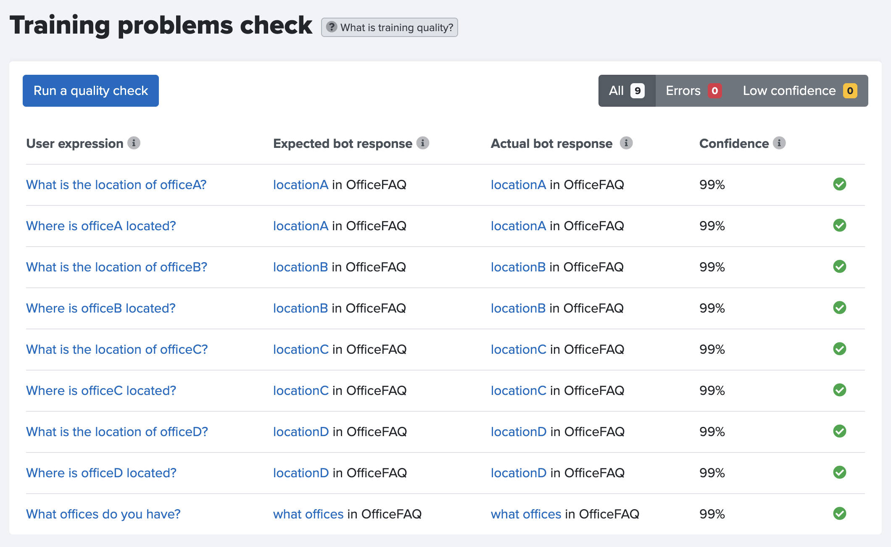

It is good practice to use the highlighting technique to tell your chatbots, which words should be treated with more importance.

This is useful both in the case where you have a lot of very similar triggering expressions, but also in general so that your chatbot would always understand what words it should pay special attention to.

> Conclusion: Provide your chatbot with multiple expressions, to help the chatbot identify the keywords.

### Tip #4 — Remove Stop Words

We can also improve NLP matching by looking at the **Stop Words**. These are words like: is, are, my, to, the, a, an, of. Words like that usually don't bring much value when it comes to NLP matching process. On the contrary, Stop Words tend to add more unnecessary variables.

Another way to solve the original problem could be achieved by removing the **Stop Words** (is), (the) and (of) from: *"What **~~is~~ ~~the~~** location **~~of~~** officeX?"*. As a result, each expression should look like: "What location officeX?". 
Like this:


When we rerun Problems check — note that we are not including the second expression used for highlighting — we should once more get all successful matches like this:

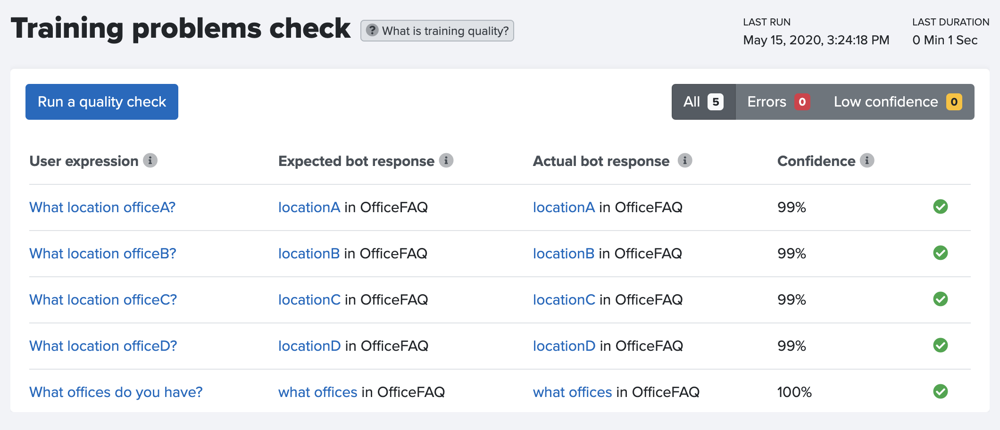

Also, when we run Understanding Test for: "What is the location of the officeA?", we still get a successful match to **locationA**, like this:

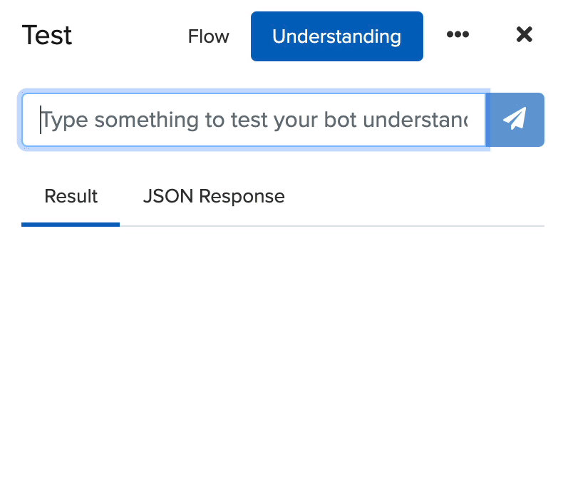

It is good practice to remove Stop Words from triggering expressions. This way we only keep the words that are useful for NLP matching, as a result, we should expect more consistent results.

> Conclusion: Make the training expressions concise, to help the chatbot identify the keywords.

### Tip #5 — Convert Similar Q&As to Guided Tasks

We can also use a Guided Task to teach our chatbot how to respond to very similar questions, where the key difference is just the name of the entity (like the office name).

The idea is to create a Guided Task, in which the chatbot is aware of all office entities — together with info like their address or phone number — that provides the address for the requested office.

#### Scenarios

The chatbot should be able to handle the following scenarios:

**Scenario A: Where is your (office-name) office?**

When the user provides an office name, the chatbot should identify the office, and then return the address.

🦸🏻‍♀️  Where is your Boston office?
🤖  The address is: 14 Oak Park Drive, Bedford, MA 01730

**Scenario B: Where is your office?**

When the user asks for the location of an office but doesn't provide the name of that office. Then the chatbot should prompt the user to specify which office and provide available options. Finally, when the user selects an office, the chatbot should respond with the answer.

👨🏽‍💼  Where is your office?
🤖  Which office are you interested in?
🤖  (Boston) (London) (Sofia)
👨🏽‍💼  Boston
🤖  The address is: 14 Oak Park Drive, Bedford, MA 01730

#### A High-level explanation of how to create a guided task

Please, note that we will not get into too many details on how to create a guided task here

**Step 1**

Create an entity for the office. This is where we instruct what offices the chatbot should be able to recognise, together with attributes like address and phone number for each office.

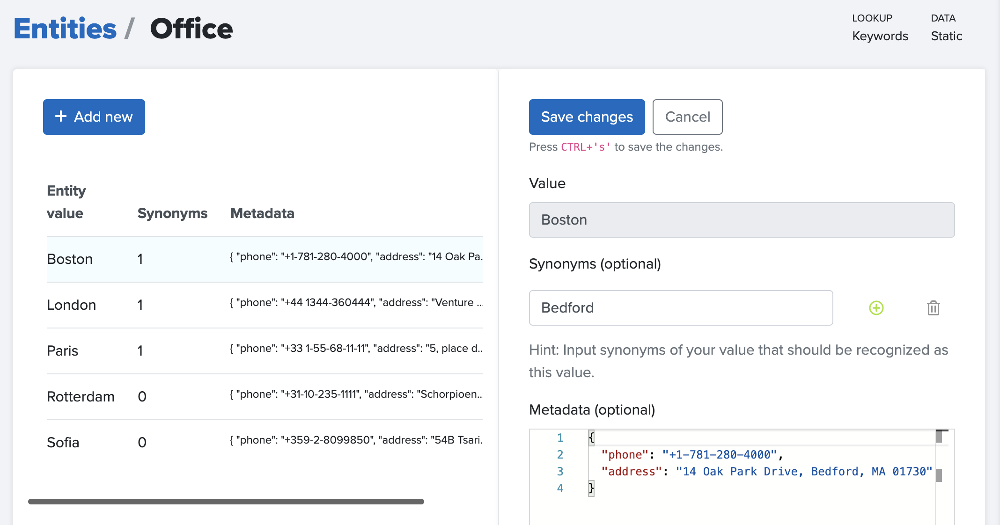

**Step 2**

Create a new conversation in the Cognitive Flow.

This conversation has two jobs:

- ask the user: "Which office are you interested in?"
- and when have the office entity, then provide them with the address

Here is how the code for a conversation like this looks like:

```json
"office-location": {
  "type": "goal",
  "steps": [
    {
      "type": "question",
      "entity": "office",
      "entity-type": "Office",
      "messages": [
        "Which office are you interested in?"
      ],
      "display": {
        "type": "quick-reply"
      }
    },
    {
      "type": "message",
      "messages": [
        "The address is: {{office.address}}."
      ]
    }
  ]
}
```

**Step 3**

Add conversation trigger to tell the chatbot, when to trigger this conversation.

We can use expressions like:

- Where is office?
- What is address for?

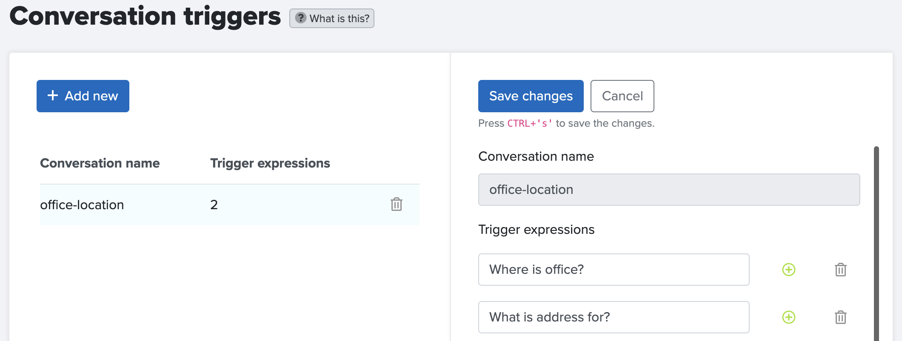

**Step 4**

And now we can test our new conversation, which should be able to handle both scenarios:

-  Where is the Boston office?
- Where is your office?

Like this:

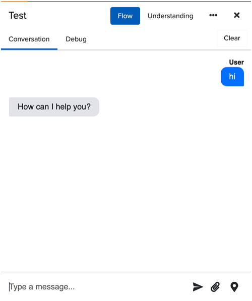


>  Although building Guided Tasks requires more work upfront, it makes it a lot easier to add a new office, without having to change the flow of the conversation, but also it gives us a lot more control over the flow of the conversation.

**How to create a Guided Task from Start to Finish**

You can watch the following video to learn how to create this Guided Task in less than 5 minutes.

<video width="600px" controls playsinline>
  <source src="convert-similar-Q&As-to-guided-tasks.mp4" type="video/mp4">
  Your browser does not support the video tag.
  <a href="./convert-similar-Q&As-to-guided-tasks.mp4?raw=true">Download the video from here</a>
</video>

### Summary

When building chatbots and training them to understand the user input better, you should follow the following rules:

**Test**

- Test often with **Understanding**
- Use **Problems Check** to test all triggering expressions

**Use NLP Techniques to help your chatbot identify the important words**

- **Highlight** Key Words => Provide multiple training phrases
- Remove **Stop Words** => Make expressions concise

**Use Guided Tasks**

- Convert similar Q&As to Guided Tasks

## Try NativeChat

If you would like to build a chatbot, [NativeChat](https://www.progress.com/nativechat) is an innovative AI-driven platform for creating and deploying secure cognitive chatbots that automatically learn and adapt to generate a natural conversation flow for customers on the channel of their choice—web, social or mobile.

You can learn to build a chatbot in a few hours. Just follow this step-by-step [tutorial](https://www.progress.com/nativechat/chatbot-tutorial) and soon you will have a chatbot that can both answer straight questions and answers, and also handle more complex conversations.